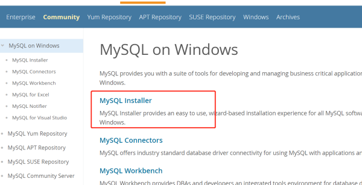
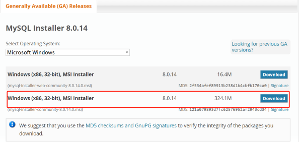
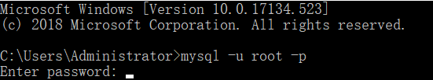
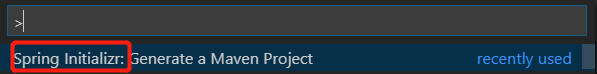
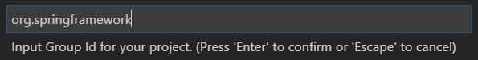
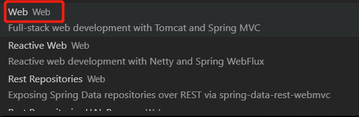

>Spring Boot最好的学习方法就是实战训练，今天我们用很短的时间启动我们第一个Spring Boot应用，并且连接我们的MySQL数据库. 我将假设读者为几乎零基础，在实战讲解中会渗透Spring框架中的一些知识点，并提供相关官方文档链接, 让我们一起在实战中高效学习。

在这个实战学习中, 我们将使用`Spring Boot`与`MySQL`数据库构建一个简单的登陆系统，功能包含*注册账户*和*登陆*两个功能，并用`Spring Boot`官方推荐使用的`thymeleaf`模板来生成简单的前端页面。

看完这篇教程，你将做出这样一个应用：


可以看到上方的"Hello, null!"字样, null为当前已登陆的用户名, 若未登陆, 则显示为null.

下方的注册新账户, 需要填写用户名, 邮箱, 密码, 常规操作, 登陆需要邮箱和密码, 在最下方有*查看所有注册账号信息*的功能, 点击之后可以看到所有已注册的账号的全部信息.

看完该文章, 你将学会:

1. 使用MySQL shell工具连接到MySQL server, 创建一个用户, 并创建一个数据库.
2. 学习在Spring中配置并连接到你的MySQL数据库.
3. 学习并掌握Jpa的Entity, Repository的使用方法.
   
好, 我们开始.

## 配置MySQL数据库

第一步我们需要将MySQL数据库下载到电脑里, 下载地址: 
[下载MySQL完整工具包](https://dev.mysql.com/downloads/windows/)

在页面中点击红线框住的部分:



点进去, 拉到页面下方, 点击红框部分右侧的`download`:



下载后, 按照安装包提示的步骤操作, 安装完毕后, 你会获得几个新应用, 我们只用其中一个, 它是:


它是MySQL的命令行工具, 我们用它来操作我们的MySQL数据库.

但是我们不直接点开它, 我们在Windows自带的Command Prompt中使用它.

1. 打开Command Prompt, 输入:

```
mysql -u root -p
```
进入Mysql命令行工具, 会提示你输入密码:



输入在安装过程中设置的密码, 进入mysql命令行工具.

2. 创建一个MySQL用户, 在命令行中输入命令(其实是SQL语句):

```
CREATE USER 'niudai'@'localhost' IDENTIFIED BY 'niudai';
```
这个语句的目的是创建一个用户名为'niudai', 登陆密码为'niudai'的MySQL数据库管理员, 用这个账号可以管理我们的数据库, 也就是说如果你要管理数据库, 你必须要有这么一个账号.

3. 再输入如下语句:

```
CREATE DATABASE springdb;
```
熟悉SQL语言的同学应该很熟悉上面这句, 就是创建一个名为`springdb`的数据库, 这个数据库就是我们的Spring Boot应用要连接的.

4. 赋予刚创建的用户名为"niudai"的用户管理`springdb`数据库的所有权限:
   
```
GRANT ALL ON springdb.* TO 'niudai'@'localhost';
```

## 创建一个Spring Boot应用

作者本人是使用`Visual Studio Code`进行该应用的开发, 加装Spring官方提供的VSCode插件, 可以轻松进行开发, 当然如果你喜欢用`IDEA`或`Eclipse`, 或`STS`也行, 但根据本人体验, `VSCode`上的体验远超`Eclipse`和`STS`, 推荐读者尝试.

我安装了全套`Java`, `Spring`, `Maven`的扩展, `ctrl`+`shift`+`P`打开命令行, 搜索`Spring Initializer`命令.



因为我们用Java语言开发, 所以选择Java语言:


输入Group ID, 也就是你的这个应用所属的群的名称, 我们输入`org.springframework`(其实输什么都行, 无所谓).



然后输入我们的Artifact ID, 就是你这个项目的ID, 我输入`gs-logging-data-mysql`(随便输, 无所谓).

然后选择最新Spring Boot版本, 然后选择如下Spring Boot依赖:




一共四个依赖, 全是Spring Boot官方支持的库, 知识点讲解:

1. `Thymeleaf` 是现代服务端的Java模板引擎, 我们用它来生成HTML页面.
2. `JPA` 是Java Persistence API, 也就是Java持久层API, 它的本质是一套将Java的对象映射到数据库中的关系表的标准, 而`Spring-Boot`的`JPA`依赖包含一个重要子依赖, 你一定听过它的名字: `Hibernate`. 它是`JPA`的具体实现, 也是`Spring Boot`的默认`JPA`实现.[官方文档相关知识点阅读](https://docs.spring.io/spring-boot/docs/2.1.2.RELEASE/reference/htmlsingle/#boot-features-jpa-and-spring-data)
3. `MySQL` 是用来实现从Java到MySQL连接的一个中间件.
4. `Web` 是`Spring Boot`重要核心组件, 网络应用的必须品, 它包含了`Tomcat`容器, `Spring MVC`等核心组件.

所以我们也可以看到`Spring Boot`其实相当于一个依赖打包器, 比如网络模块, 大家都需要`Tomcat`容器, 也需要`Spring MVC`框架, 那索性就放到一个包里, 也就是`Web`包, 这样一个依赖就解决了问题.

## 配置application.properties文件
`application.properties`文件的作用有点类似于`pom`, 但也不太一样, `pom`是管理你应用和其他库的依赖关系, 而`application.properties`则是去设置, 或是配置这些依赖, 是Spring应用的重要组成部分.

[`Spring Boot`官方文档推荐阅读](https://docs.spring.io/spring-boot/docs/2.1.2.RELEASE/reference/htmlsingle/#boot-features-configure-datasource)

该文件可以在maven工程的`src/main/java/resources/applicatio.properties`下找到.

在该文件中输入如下属性:
```
spring.datasource.username=niudai
spring.datasource.password=niudai
spring.datasource.url=jdbc:mysql://localhost:3306/springdb
spring.jpa.hibernate.ddl-auto=create
```
讲解:

第三行的`url`就是我们数据库的地址, `3306`是MySQL默认的本地端口, 而`springdb`正是我们之前创建的数据库.

第一行和第二行声明了我们之前创建的用户名密码和账户名, 都为`niudai`

第四行的`create`为开发模式, 就是每次应用启动都重新创建一个新表, 原有的表会清空, 开发结束后可以将其设置为`none`.

声明了这些之后, 启动应用后, `Spring`会自动用上述的信息连接并登陆你的`MySQL`中名为`springdb`的数据库.

## 创建你的Entity

什么是`Entity`呢? 说白了就是会被映射到数据库中的`Java Object`, 比如我们将要创建的`User`类.

在`src/main/java/`下创建一个文件`User.java` :

```
package org.springframework.gsloggingdatamysql;

import javax.persistence.Entity;
import javax.persistence.GeneratedValue;
import javax.persistence.GenerationType;
import javax.persistence.Id;

@Entity
public class User {
    @Id
    @GeneratedValue(strategy=GenerationType.AUTO)
    private Integer id;
    private String name;
    private String email;
    private String password;

    @Override
    public String toString() {
        return "{" +
            " id='" + getId() + "'" +
            ", name='" + getName() + "'" +
            ", email='" + getEmail() + "'" +
            ", password='" + getPassword() + "'" +
            "}";
    }

    public String getPassword() {
        return this.password;
    }

    public void setPassword(String password) {
        this.password = password;
    }

    public Integer getId() {
        return this.id;
    }

    public void setId(Integer id) {
        this.id = id;
    }

    public String getName() {
        return this.name;
    }

    public void setName(String name) {
        this.name = name;
    }

    public String getEmail() {
        return this.email;
    }

    public void setEmail(String email) {
        this.email = email;
    }
}
```

加了`@Entity`注解, `Spring`框架会得知这个类是一个`Entity`, `Hibernate`会把这个类映射到数据库中的关系表, 这个关系表的列与`User`的所有属性一一对应.

相当于SQL语言中的:
```
CREATE TABLE User(id int, name varchar(255), email varchar(255), password varchar(255));
```

## 创建UserRepository

如果说User代表每个用户, 或是用户的信息, 那么UserRepository就代表储存这些用户的"库", 我们创建一个`UserRepository.java`, 注意它是一个接口, 也就是`Interface`, 而不是`Class`.

```
package org.springframework.gsloggingdatamysql;

import java.util.List;

import org.springframework.data.repository.CrudRepository;

public interface UserRepository extends CrudRepository<User, Integer> {
    List<User> findByEmail(String email);
    void deleteByEmail(String email);
}
```

你可能会疑惑这只是一个接口, 并没有具体实现, 如何完成对User信息的储存, 但事实上你只需声明这个接口, 剩下的交给`Spring`, 它会自动为你进行它的实现.

该类继承了`CrudRepository`, 也就是支撑"增删改查"的一个Repository, 你可以在别的地方直接调用这个接口的方法, 方法名有规范, 比如你想通过邮箱查找, 那你就使用`findByEmail(String email)`方法, `Spring`会自动帮你将`findByEmail`转换成SQL语言中的`SELECT * FROM UserRepository WHERE email = 'email'

[相关官方文档阅读](https://docs.spring.io/spring-boot/docs/2.1.2.RELEASE/reference/htmlsingle/#boot-features-entity-classes)

## 创建你的UserController

`Controller`是接受用户的`url`请求, 将`url`映射到某个具体的方法, 处理`url`请求, 再返回一个`Model`的东西, 是`Spring MVC`中的`C`层.

知识点: Spring MVC中的三层分别是`Model`, `View`, `Controller`. 当用户向你的服务器发送了请求后, 比如HTTP请求, `Controller`先将请求映射到某个方法上, 方法根据该请求进行相应处理, 返回`Model`, 这个`Model`可以被理解成一个抽象的数据模型, 它储存了网页必须包含的信息, 但是它不是网页本身, `Model`会被送到`View`层, 也就是用户界面层, `View`层将自己本身的模板和`Model`内部的数据结合成为完整的一个页面, 作为`response`返还给用户, 用户便看到了你的页面, 但是现在随着前后端的分离, `View`层的意义已经不大,作为后端开发, 主要专注于`Model`和`Controller`.

创建一个文件: `UserController.java`:
```
package org.springframework.gsloggingdatamysql;

import java.util.List;

import org.slf4j.Logger;
import org.slf4j.LoggerFactory;
import org.springframework.beans.factory.annotation.Autowired;
import org.springframework.stereotype.Controller;
import org.springframework.ui.Model;
import org.springframework.web.bind.annotation.GetMapping;
import org.springframework.web.bind.annotation.RequestParam;
import org.springframework.web.bind.annotation.ResponseBody;

@Controller
public class UserController {
    private static final Logger log = LoggerFactory.getLogger(UserController.class);

    @Autowired
    private UserRepository userRepository;

    @GetMapping(path="/add") // Map ONLY GET REQUESTs.
    public @ResponseBody String addNewUser (@RequestParam String name
                    , @RequestParam String email, @RequestParam String password, User user) {
        // @ResponseBody means the returned String is a response, not a view name.
        user.setName(name);
        user.setEmail(email);
        user.setPassword(password);
        userRepository.save(user);
        log.info(user.toString()+" saved to the repo");
        return "Saved";
    }

    /**
     * 登陆方法, 用户输入邮箱和密码, 查询数据库检验是否有该账户,如果有,
     * 返回原先页面 ,登陆成功。
     * @param email 用户邮箱
     * @param password 用户密码
     * @param model Spring MVC中的Model，用来储存经过controller处理后的信息，再由View层渲染
     *         得到前端页面。
     * @return
     */
    @GetMapping(path = "/login")
    public String login(@RequestParam String email, @RequestParam String password, Model model) {
        List<User> users = userRepository.findByEmail(email);
        // 如果数据库中未查到该账号:
        if (users == null) {
            log.warn("attempting to log in with the non-existed account");
            return "该用户不存在";
        } else {
            User user = users.get(0);
            if (user.getPassword().equals(password)) { 
                // 如果密码与邮箱配对成功:
                model.addAttribute("name", user.getName());
                log.warn(user.toString()+ " logged in");
            } else {
                // 如果密码与邮箱不匹配:
                model.addAttribute("name", "logging failed");
                log.warn(user.toString()+ " failed to log in");
            }
            return "index";
        }  
    }

    /**
     * 查看所有用户的注册信息，按照Spring Boot的设定，以Json的形式输送给用户端。
     * @return
     */
    @GetMapping(path="/all")
    public @ResponseBody Iterable<User> getAllUsers() {
        return userRepository.findAll();
    }

    /**
     * 域名的根目录，然后返回的“index”会映射到
     * java/resources/templates/index.html文件。
     * @param name 
     * @return
     */
    @GetMapping(path="/")
    public String welcomePage(@RequestParam(name="name", required=false, defaultValue="World")
        String namel){
            return "index";
    }


}
```
知识点讲解:

1. `@AutoWired` 被注有它的注解会被`Spring`得知, `Spring`会自动为你注入依赖. 比如上述的`userRepository`, `Spring`在运行过程中会通过`IoC容器`为你注入一个`UserRepository`的实例给`userRepository`. 相关知识点: `依赖注入`、`设计模式`.
2. `@GetMapping` 将使用`Get`方法的`HTTP`请求映射到被注的方法. 相关知识点: `HTTP请求`, `HTTP方法`.
3. `@RequestParam` 将`HTTP请求`中用户传入的参数映射到变量中括号内指定变量中. 相关知识点: `HTTP参数`
4. `@ResponseBody` 它表示该方法返回的值就是`Response`本身, 不需传递至`View`被渲染, 用户直接得到该方法的返回值.

其余讲解在代码内的注解中.

## 创建前端页面模板

在`resources/templates/`目录下创建一个`index.html`文件, 它便是我们应用的入口界面.

```
<!DOCTYPE HTML>
<html xmlns:th="http://www.thymeleaf.org">

<head>
    <title>Spring Boot实战训练: Spring+Mysql 构建一个简单的登陆注册系统</title>
    <meta http-equiv="Content-Type" content="text/html; charset=UTF-8" />
    <link rel="stylesheet" href="index.css">
</head>

<body>
    <h2>实例驱动学习之Spring框架: </h2>
    <p>----Spring Boot+MySQL 构建一个简单的登陆注册系统</p><br>
    <p th:text="'Hello, ' + ${name} + '!'" />
    <div class="add">
        <h2>注册新账号</h2>
        <form action="/add" method="GET">
            用户名:<input type="text" name="name"><br>
            邮箱:<input type="text" name="email"><br>
            密码:<input type="password" name="password"><br>
            <input type="submit" value="注册">
        </form>
    </div>
    <div class="login">
        <h2>登陆已有账号</h2>
        <form action="/login" method="GET">
            邮箱:<input type="text" name="email"><br>
            密码:<input type="password" name="password"><br>
            <input type="submit" value="登陆">
        </form>
    </div>
    <div class="all">
        <h2><a href="/all">查看所有注册账号信息</a></h2>
    </div>
</body>

</html>
```

## 运行我们的Spring Boot应用

我们在VSCode的内置命令行工具里输入`mvn spring-boot:run`, 然后几秒钟等待, 运行成功, 可以用浏览器输入网址`localhost:8080`来使用我们的应用.

>致力于IT类技术文章分享, 有时会写点科幻小说, 欢迎各种工作邀请, 技术交流。主要技能集中在Web方向, 后端为主，前端也有涉猎，Spring框架深度学习中, Java死忠粉, 同时喜欢用Python 写点小玩意儿, 时刻关注前沿技术, 对一切新工具, 新技术保持好奇心和学习心,不放过任何一个可以提高工作效率的工具或方法。

>个人主页: niudai.github.io
>微信: 18324748963


