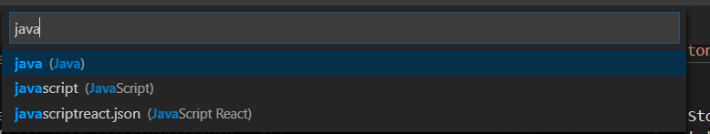

>Spring Boot最好的学习方法就是实战训练，今天我们用很短的时间启动我们第一个Spring Boot应用，并且制作一个文件上传系统, 用户可以将本地文件上传到服务器上。我将假设读者为几乎零基础，在实战讲解中会渗透Spring框架中的一些知识点，并提供相关官方文档链接, 让我们一起在实战中高效学习。

该文章来自于我的`Github`项目[Spring-by-example](https://github.com/niudai/Spring-by-example), 该项目里有详细的实战`Spring Boot`小应用工程源代码和配套详解, 在每个小应用中的`README.md`就是该小项目的讲解, 本篇文章来自`gs-niudai-uploading-files`项目中的`README.md`文件。

看完这篇教程, 你将做出这样一个应用:


用户点击`Choose File`按钮, 会打开用户本地的文件系统, 点击`提交`会将用户选中的文件上传到我们的服务器中。

在这篇文章中，你将学到：

1. `@ConfigurationProperties`注解的使用方法。
2. `CommandLineRunner`的使用方法。
3. 与文件相关的API, 比如`File`, `Path`, `Resource`，`MultipartFile`等的用法。
4. 在Spring中, 如何接受并处理用户传入的`MultipartFile`。

## 创建我们的Spring Boot应用
首先在你的IDE中创建我们的`Spring Boot`应用，选择`Web`模块和`Thymeleaf`模块，答主用的是`Visual Studio Code`，关于具体如何在其中创建应用，请参考本人之前的文章：

[十五分钟用Spring Boot+MySQL做一个登陆系统](https://zhuanlan.zhihu.com/p/55796334)


## StoreService 接口及其实现
`StoreService`的接口, 我们通过调用这个接口来实现对用户传入文件的储存, 删除, 初始化等操作:

```
package org.springframework.gsniudaiuploadingfiles;

import java.nio.file.Path;
import java.util.stream.Stream;

import org.springframework.core.io.Resource;
import org.springframework.stereotype.Service;
import org.springframework.web.multipart.MultipartFile;

/**
 * 存储服务的接口, 用来存储, 删除, 调用用户传入
 * 的文件。
 */
@Service
public interface StoreService {

    /**
     * 储存用户传入的文件。
     * @param file
     */
    void store(MultipartFile file);

    /**
     * 初始化用户储存用户文件的文件夹。
     */
    void init();

    /**
     * 根据文件名返回用户存储的文件。
     * @param filename 文件名
     * @return 文件路径
     */
    Resource retrieve(String filename);

    /**
     * 根据用户名返回用户存储的文件的路径。
     * @param filename 文件名
     * @return 文件路径
     */
    Path retrievePath(String filename);

    /**
     * 返回用户传入所有文件的文件名，以Stream的形式。
     * @return 
     */
    Stream<Path> retrieveAllPath();

    /**
     * 删除所有用户传入的文件。
     */
    void deleteAll();
    
}
```
先写一个这样的接口，它作为`抽象层`，本身没有什么东西，我们可以在方法注释中看到这些接口的功能。

然后我们写一个具体的实现，`StoreFileService.java`：
```
@Service
public class StoreFileService implements StoreService {
    private final Logger logger = LoggerFactory.getLogger(StoreFileService.class); // 用Logger打印日志
    private final Path rootDirectory; // 存储用户名的文件夹位置

    /**
     * 传入了一个参数：storeProperties，故名思意就是“存储属性”，一切关于存储
     * 有关的属性，比如用户文件存储在哪里，一个文件夹里最多储存多少文件等，这些
     * 属性都存储在storeProperties中。
     * 使用@Autowired让IoC容器自动注入你的StoreProperties依赖。
     * @param storeProperties
     */
    @Autowired
    public StoreFileService(StoreProperties storeProperties) {
        rootDirectory = Paths.get(storeProperties.getLocation());
    }

    /**
     * 先使用File API中的 .getInputStream() 获得传入文件的输入流（InputStream），
     * 再调用Files API 中的 .copy(InputStream, target, copyType) 来将传入的文件
     * 写进目标路径中, target就是我们的目标路径, 详情可查阅相关文档。
     */
    @Override
    public void store(MultipartFile file) {
        String filename = file.getOriginalFilename();
        logger.info("filename");
        try {
            InputStream inputStream = file.getInputStream();
            Files.copy(inputStream, this.rootDirectory.resolve(filename), StandardCopyOption.REPLACE_EXISTING);
        } catch (IOException e) {
            throw new StorageException("Failed to store file ");
        }
    }

    /**
     * 使用File API中的.mkdir()创建一个目录, 目录是由rootDirectory指定的。
     */
    @Override
    public void init() {
        File file = new File(rootDirectory.toString());
        file.mkdir();
    }

    /**
     * 使用Spring Mvc推荐的UrlResource API来获取我们的储存
     * 文件，先把Path路径转换成URI，再传入到UrlResource中，获得
     * 我们的指定文件。
     */
    @Override
    public Resource retrieve(String filename) {
        Path path = retrievePath(filename);
        Resource resource;
        try {
            resource = new UrlResource(path.toUri());
            return resource;
        } catch (MalformedURLException e) {
            throw new StorageException("Failed to store file ");
        }
    }

    /**
     * 使用了Path API中的 .resolve 方法, 让文件名附着在存储文件夹的路径后, 构成
     * 文件的完整路径。
     */
    @Override
    public Path retrievePath(String filename) {
        return rootDirectory.resolve(filename);
    }

    /**
     * 使用Files API 中的 .walk 方法, 对根目录中所有直接子
     * 文件进行扫描，该方法返回一个Stream对象，关于Java Stream
     * API的内容大家可以去查阅相关内容。
     */
    @Override
    public Stream<Path> retrieveAllPath() {
        try {
            return Files.walk(rootDirectory, 1).
                filter(path -> !path.equals(this.rootDirectory))
                .map(rootDirectory::relativize);
        }
        catch(IOException e) {
            throw new StorageException("Failed to read stored files", e);
        }
    }

    /**
     * 使用 FileSystemUtils API 中的 .deleteRecursively()方法将文件夹中
     * 的所有文件全部删除, 用于文件夹的清零。
     */
    @Override
    public void deleteAll() {
        FileSystemUtils.deleteRecursively(rootDirectory.toFile());
    }

}
```
在上面的类中出现了我们自定义的一个类：`StoreProperties`，我们来看它的代码：
```
/**
 * 知识点讲解:
 * 1. @ConfigurationProperties 注解
 *    注有该注解的类, 类中的变量可以通过外接的.properties文件进行配置, 比如下面这个例子, 由于我在application.properties文件中声明了"storage.location=upload", 在Spring运行过程中, location的值会被配置为"upload", 这也是一种依赖注入的方式.
 */
@ConfigurationProperties("store")
public class StoreProperties {
    private String location;

    public String getLocation() {
        return this.location;
    }

    public void setLocation(String location) {
        this.location = location;
    }

}
```
我们再写一个`StorageException`，当文件储存出现错误时，抛出这个`Exception`：
```
public class StorageException extends RuntimeException {
    private static final long serialVersionUID = 1L;

    public StorageException(String message) {
        super(message);
    }
    public StorageException(String message, Throwable cause) {
        super(message, cause);
    }
}
```
小贴士：
由于我们经常使用这种自定义的`Exception`，我们可以在`Visual Studio Code`中自定义一个代码碎片(`Code Snnipet`), 当我们再需要写这段代码的时候，直接打出它的前缀，编辑器会为我们自动补全这段代码。

在编辑器中选择`File` -> `Preferences` -> `User Snnipet`, 然后在弹出的页面中选择`Java`语言，说明我们现在的代码随便只对`Java`语言有效。



然后代开我们的代码碎片编辑页面，发现这个编辑文件是`json`格式的，这不奇怪，我们只需按照注释中的提示将我们的代码碎片写进去：

```
	"Exception Extension": {
		"prefix": "exception",
		"body": [
			"public class $1 extends RuntimeException {", 
			"\tprivate static final long serialVersionUID = 1L;",
			"\tpublic $1(String message) {",
			"\t\tsuper(message);",
			"\t }",
			"\tpublic $1(String message, Throwable cause) {",
			"\t\tsuper(message, cause);",
			"\t}",
			"}"
		],
		"description": "Exception extends RuntimeException"
	}
```
我们在`body`中写上我们的代码碎片，缩进用`\t`替代，每行代码分别用引号括住，就是常规的`json`格式，然后在`prefix`中写上`exception`，这样我们在`java`文件中就可以打出`exception`, 智能补全会弹出我们的代码碎片，选择了我们的代码碎片后，就可以直接调出我们的这块代码，`description`则是对我们代码碎块的描述，类似于文档。

更详细的教程，请参考`Visual Studio Code`官方教程：

[怎样使用代码碎片功能](https://code.visualstudio.com/docs/editor/userdefinedsnippets)

## 前端静态HTML页面

在`src/main/resources/templates`中创建一个`html`文件，命名为`index.html`，它就是我们的入口页面，而支持它工作的正是我们的`ThymeLeaf`模板引擎。

简单的写个表单(`Form`)：

```
<!DOCTYPE html>
<html lang="en">
<head>
    <meta charset="UTF-8">
    <meta name="viewport" content="width=device-width, initial-scale=1.0">
    <meta http-equiv="X-UA-Compatible" content="ie=edge">
    <title>文件上传实例</title>
</head>
<body>
    <h1>实例驱动学习之Spring框架--</h1>
    <h2>十五分钟用Spring Boot做一个文件上传系统</h2>
    <form action="/" method="POST" enctype="multipart/form-data">
        <input name="file" value="上传文件" type="file">
        <input type="submit" value="提交">
    </form>

    
</body>
</html>
```
注意到我们的第一个`input`标签，它的类型是`file`, 也就是文件, 因为我们要传入的不是普通的文本`text`或是密码`password`, 而是文件本身, 而且在`form`的属性中, `enctype`的值为`multipart/form-data`, 一般而言如果用户上传的是文件, 我们就要使用`multipart/form-data`。

## Spring MVC中的Controller

写完了我们的`StoreService`, 我们可以开始`Controller`的开发, 创建一个`UploadController.java`作为我们的控制器。

```
@Controller
public class UploadController {

    private final StoreService storeService;

    /**
     * 构造函数，传入一个StoreService，IoC容器会自动注入该实例，
     * 也就是我们的StoreFileService的实例。
     * @param storeService
     */
    @Autowired
    public UploadController(StoreService storeService) {
        this.storeService = storeService;
    }

    /**
     * 将“/”对应的Post请求映射到这个方法，然后存储文件，返回一个跳转页面，并且将成功上传页面的信息
     * 传给下一个页面。
     * 知识点：FlashAttribute 详情请参见本人文章：
     * 《Spring MVC 之 Flash Attribute详解》https://zhuanlan.zhihu.com/p/55983646
     * @param file 用户上传的文件
     * @param redirectAttributes 跳转属性
     * @return 跳转页面名
     */
    @PostMapping("/")
    public String uploadHandler(@RequestParam("file") MultipartFile file, 
                RedirectAttributes redirectAttributes) {
        // we need an interface for storing the file, and an implementation of the store interface.
        storeService.store(file);
        redirectAttributes.addFlashAttribute("message", "you successfully uploaded");
        // store the file
        return "redirect:/";
    }

    /**
     * 映射到入口页面。
     */
    @GetMapping("/")
    public String index() {
        return "index";
    }

}
```

## CommandLineRunner和@ConfigurationProperties

这是最后的工作了, 打开我们含有`main`方法的`DemoApplication.java`, 做如下更改:

1. 在类名上方增加注解`@EnableConfigurationProperties`,
加上它后, 我们的`StoreProperties`才能生效。
2. 增加一个返回`CommandLineRunner`的方法`init`，在该方法上方增加注解`@Bean`。

注有`@Bean`的方法，它们返回的对象会被装进IoC容器中，而返回`CommandLineRunner`的方法会在`Spring Boot`应用运行开始是运行, 所以我们将它用作初始化服务端储存空间的`init`函数的返回值。

`init`方法为:

```
@Bean
CommandLineRunner init(StoreService storagService) {
	return (args) -> {
		storagService.deleteAll();
		storagService.init();
	}
}
```
可以看到我们先进行了`deleteAll()`, 再进行`init()`, 也就是说每次`Spring Boot`应用重新运行的时候, 原有的储存信息都会被清空, 适合开发状态的应用。

